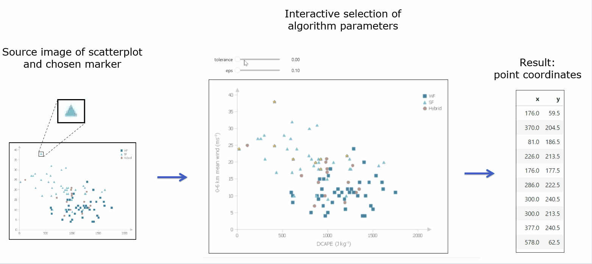
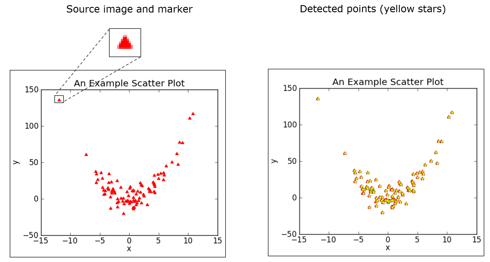
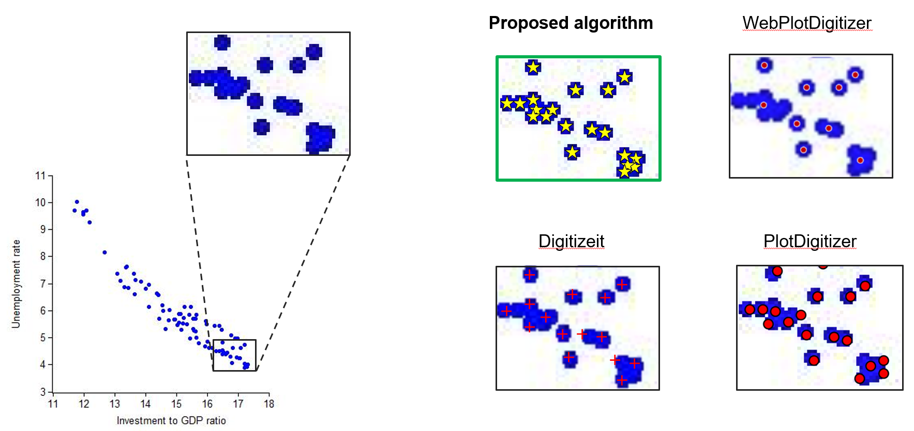
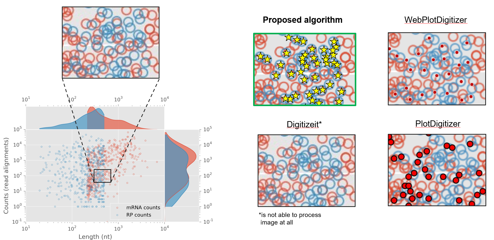

# ScanPlot

## About

This repository presents a methodology for determining the positions of points on raster images of scatter plots.


The proposed methodology is semi-automatic and needs user interation on different algorithm stages.


Firstly, user select target marker. Then, in interactive mode, user varies the parameters of the algorithm and choose the best result.
As a result, user receives the coordinates of the points for the selected marker.





The proposed algorithm considers the digitization of the scatter plot as the task of detecting a pattern in the image.
The technique of marker detection on image is based on Template Matching algorithm, Generalized Hough Transform and Mean-Shift clustering.


---

## Data requirements


Currently the algorithm supports only X-Y plots and `.png` input format.

The target image is a scatter plot, which can have several markers of any shape and color.

It is assumed that markers of the same type have approximately the same size in pixels. It is also assumed that plot axes on image are horizontally aligned.


---

## Usage

At the moment, the application does not have a graphical interface, it can be tested in Jupyter Notebook.

0) create your image test case ..........

1) Create venv and install dependincies:
```sh
python3 -m venv venv
source venv/bin/activate
pip install -r requirements.txt
```

2) Run Jupyter Notebook in created virtual environment

3) Open file `main.ipynb` and ......


---

## Algotithm results examples




<br/><br/>


---

## Comparsion with other plot digitization tools

 

Proposed algorithm was compared with existing tools for plot digitization:
- WebPlotDigitizer: https://automeris.io/
- DigitizeIt: https://www.digitizeit.xyz/
- PlotDigitizer: https://plotdigitizer.com/




<br/><br/>




---


## Future work


- [ ] Mapping the coordinates obtained by the algorithm to tick values on plot image
- [ ] Adding opportunity to select region of interest
- [ ] Implementation of the graphical interface for the algorithm
- [ ] Improving the accuracy of the algorithm


