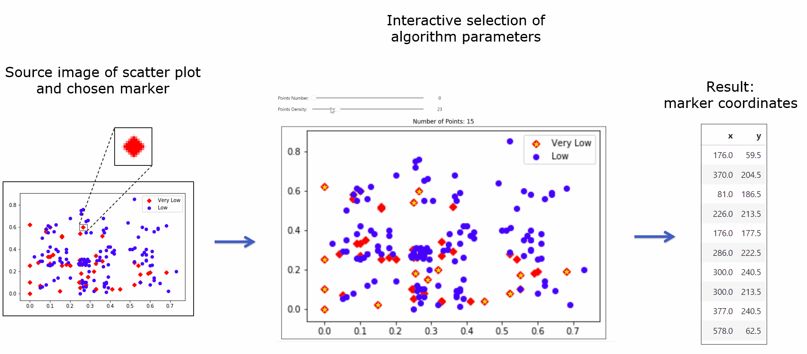
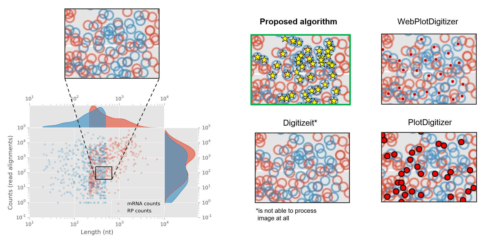

# ScanPlot

## About

This repository presents a methodology for determining the positions of points on raster images of scatter plots.


The proposed methodology is **semi-automatic** and needs user interation on different algorithm stages.


Firstly, user select target marker. Then, in interactive mode, user varies the parameters of the algorithm and choose the best result.
As a result, user receives the coordinates of the points for the selected marker.





The proposed algorithm considers the digitization of the scatter plot as the task of detecting a pattern in the image.
The technique of marker detection on image is based on Template Matching algorithm, Generalized Hough Transform and Non Maximum Suppression.


---

## Input data requirements


The algorithm supports only 3 channel RGB images.
Scatter plot may have several markers of any shape and color.


Input data that is **not supported**:
- markers with gradient color
- markers with alpha channel
- markers of the same type but with different sizes


---

## Dependencies

scanplot requires:
- Python (> 3.11, < 3.12)

---

## Usage

At the moment, the algorithm does not have a graphical interface, it can be tested in Jupyter Notebook.

**Step 1:** Clone repo
```sh
git clone https://github.com/adusachev/scanplot.git <REPO>
cd <REPO>
```

**Step 2:** Create virtual environment and install dependencies

with `pip`:
```sh
python3 -m venv venv
source venv/bin/activate
pip install -r requirements.txt
```
with `poetry`:
```sh
poetry env use python3
poetry shell
poetry install
```

**Step 3:** Open Jupyter Notebook in created virtual environment

**Step 4:** Run notebook `<REPO>/examples/main.ipynb`


---

## Algorithm results examples


<br/><br/>


---

## Comparsion with other plot digitization tools

 

Proposed algorithm was compared with existing tools for plot digitization:
- WebPlotDigitizer: https://automeris.io/
- DigitizeIt: https://www.digitizeit.xyz/
- PlotDigitizer: https://plotdigitizer.com/


<br/><br/>




---


## Future work

- [ ] Adding opportunity to select region of interest
- [ ] Adding opportunity to manually edit detected data points
- [ ] Improving the accuracy of the algorithm on b/w images
- [ ] Implementation of the graphical user interface for the algorithm
