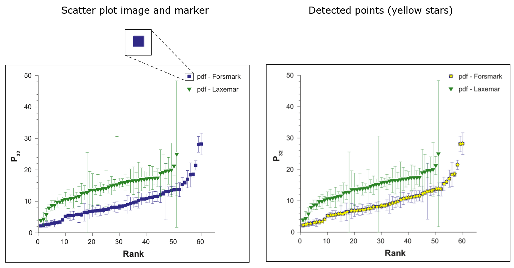

# ScanPlot

## About

This repository presents a methodology for determining the positions of points on raster images of scatter plots.


The proposed methodology is **semi-automatic** and needs user interaction on different algorithm stages.


Firstly, user select target marker. Then, in interactive mode, user varies the parameters of the algorithm and choose the best result.
As a result, user receives the coordinates of the points for the selected marker.


The proposed algorithm considers the digitization of the scatter plot as the task of detecting a pattern in the image.
The technique of marker detection on image is based on Template Matching algorithm, Generalized Hough Transform and Non Maximum Suppression.


---

## Input data requirements


The algorithm supports both grayscale and RGB images.
Scatter plot may have several marker types of any shape and color.


Input data that is **not supported**:
- markers with gradient color
- markers with alpha channel
- markers of the same type but with different sizes


---

## Installation & Usage

Detailed information about installation and usage can be found in the [user documentation](https://github.com/adusachev/scanplot/blob/master/docs/user_manual.md).


### Quickstart with Docker


1) Clone repository:
```sh
git clone https://github.com/adusachev/scanplot.git <REPO>
cd <REPO>
```

Add your data (plot images) to `<REPO>/datasets/`, so that images can be accessed from inside the Docker container.


3) Start Docker container:
```sh
docker compose up -d
```

4) Go to http://localhost:8888 and run notebook `main.ipynb`


Stop Docker container:
```sh
docker compose down
```


---

## Algorithm results examples (successful cases)


plot image source: [1]

<br/><br/>


plot image source: [5]


<br/><br/>



plot image source: [2]


<br/><br/>


plot image source: [3]

---

## Algorithm results examples (not successful cases)


<br/><br/>


---

## Comparsion with other plot digitization tools

 

Proposed algorithm was compared with existing tools for plot digitization:
- WebPlotDigitizer: https://automeris.io/
- DigitizeIt: https://www.digitizeit.xyz/
- PlotDigitizer: https://plotdigitizer.com/


<br/><br/>


---


## Future work

- [x] Adding opportunity to select region of interest
- [ ] Adding opportunity to manually edit detected data points
- [ ] Improving the accuracy of the algorithm on b/w images
- [ ] Implementation of the graphical user interface for the algorithm


---

## References

Plot image sources:


**[1]** &emsp; Meister M, Schall E, Dziak R, Spiesecke S, Thomisch K (2024) A multi-year analysis of acoustic occurrence and habitat use of blue and fin whales in eastern and central Fram Strait. PLoS ONE19(11): e0314369.

**[2]** &emsp; Darcel, C., Davy, P., Le Goc, R., de Dreuzy, J. R., &   Bour, O. (2009). Statistical methodology for discrete fracture model-including fracture size, orientation uncertainty together with intensity uncertainty and variability. 


**[3]** &emsp; Bonnet, E., Bour, O., Odling, N. E., Davy, P., Main, I., Cowie, P., & Berkowitz, B. (2001). Scaling of fracture systems in geological media. Reviews of geophysics, 39(3), 347-383.

**[4]** &emsp; Kim J, Woo HK, Vimalajeewa D, Vidakovic B (2023) Analysis and classification of 1H-NMR spectra by multifractal analysis. PLoS ONE 18(6): e0286205.

**[5]** &emsp; Diaferio, A. (1999). Mass estimation in the outer regions of galaxy clusters. Monthly Notices of the Royal Astronomical Society, 309(3), 610-622.
