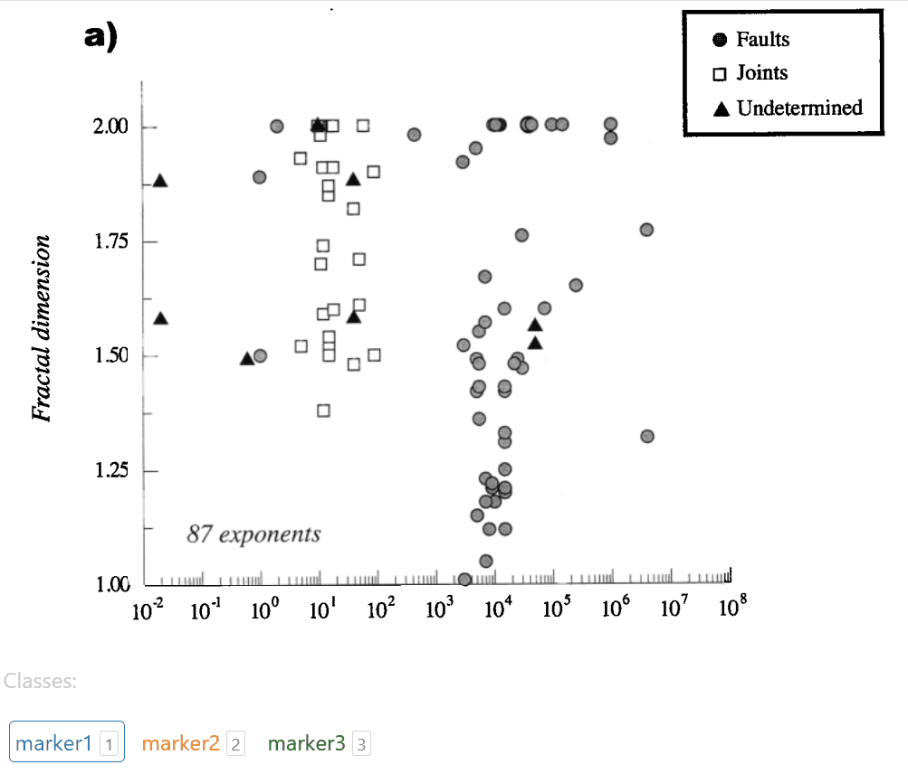
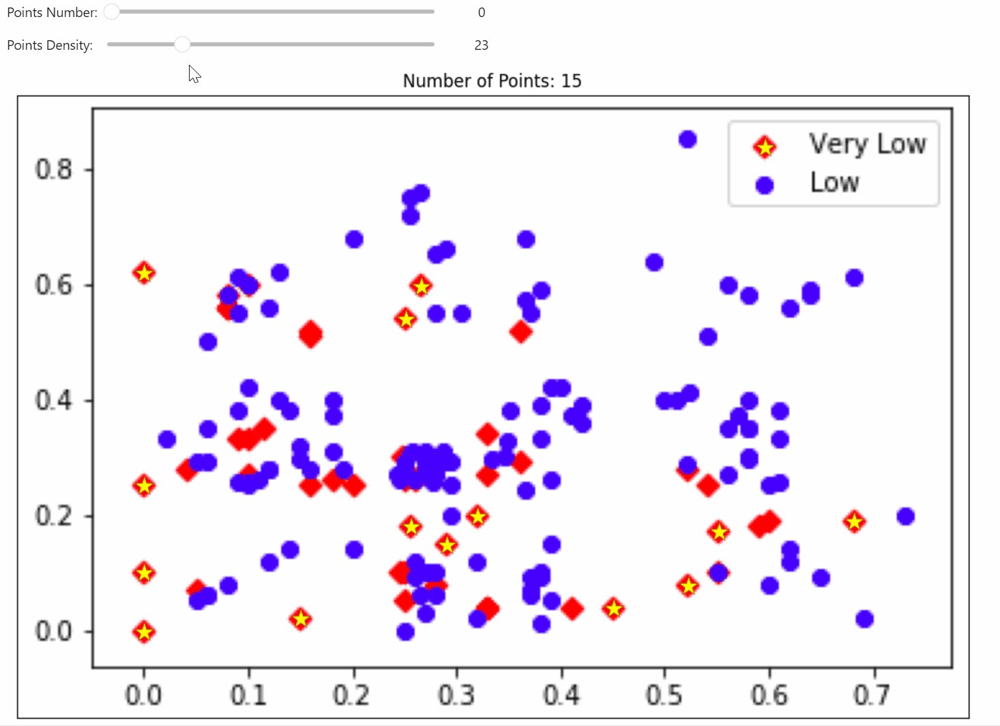
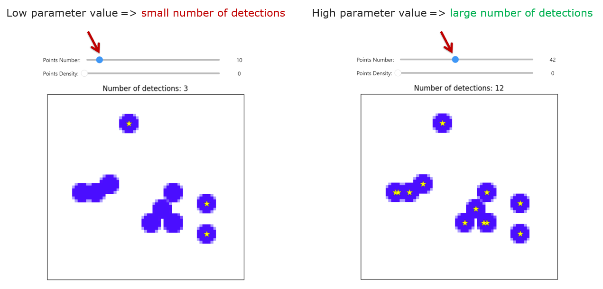
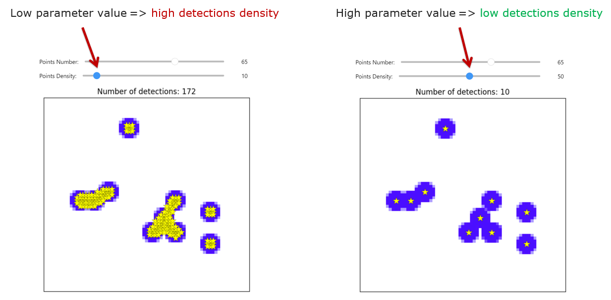
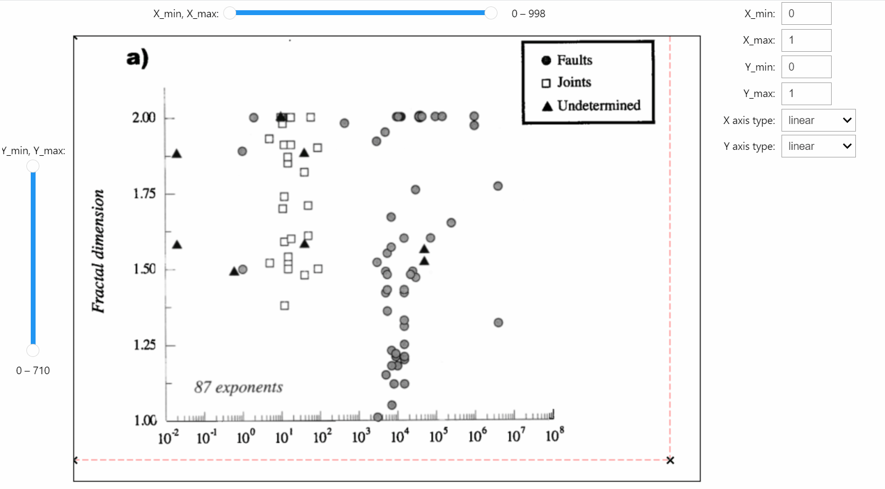
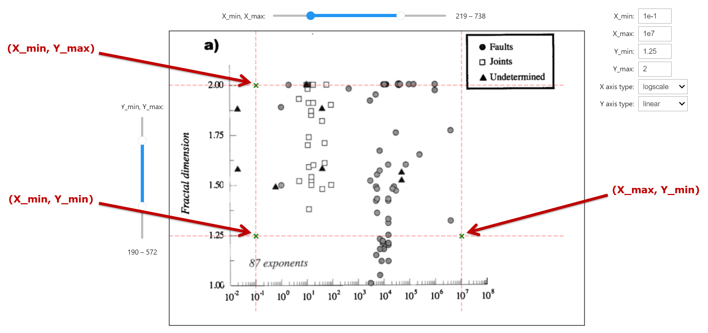

# Notes for users

### Marker selection

You can interactively select the markers that you want to detect on the plot image.

---

### ROI selection

For each choosen marker you can select its own region of interest – the area of the image where detections are allowed.

---

### Detector

The detector operates in semi-automatic mode.
You need to vary the detector parameters and choose the best result.

The detector has **2 parameters**:
- Points Number
- Points Density

The impact of these parameters on the final result is shown below:

---

### Mapping coordinates

After applying the detector, you obtain the marker coordinates in **pixels**.

So the last step is to map pixel coordinates to factual chart coordinates.

Key points in the mapper widget:

