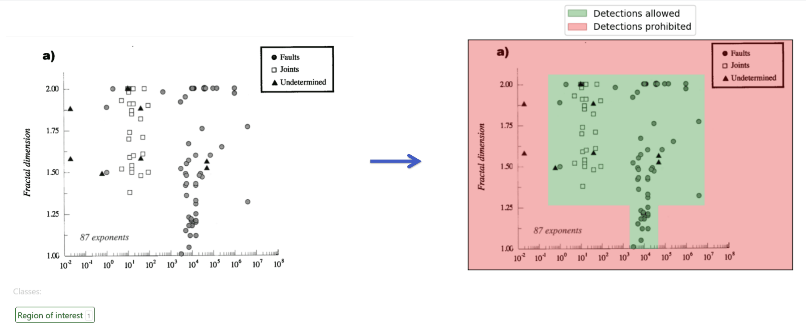

# Notes for users


### Plot image files naming


For convenience, it is highly recommended to name plot image files as `plot{N}.png` and put them to directory `<REPO>/datasets/plot_images/`.

Examples:
```
<REPO>/datasets/plot_images/plot1.png
<REPO>/datasets/plot_images/plot42.png
```


---


### Marker selection

Run notebook `<REPO>/examples/select_markers.ipynb` to automatically extract marker images from plot image.

Each selected marker will be saved as `<REPO>/datasets/marker_images/plot{N}_marker{M}.png`.


---


### ROI selection

In `<REPO>/examples/main.ipynb` you can select region of interest – the area of the image where detections are allowed.



---


### Detector


The detector operates in semi-automatic mode.
You need to vary the detector parameters and choose the best result.


The detector has **2 parameters**:
- Points Number
- Points Density


The impact of these parameters on the final result is shown below:


---

### Mapping coordinates

After applying the detector, you obtain the marker coordinates in **pixels**.

So the last step is to map pixel coordinates to factual chart coordinates.


Key points in the mapper widget:


